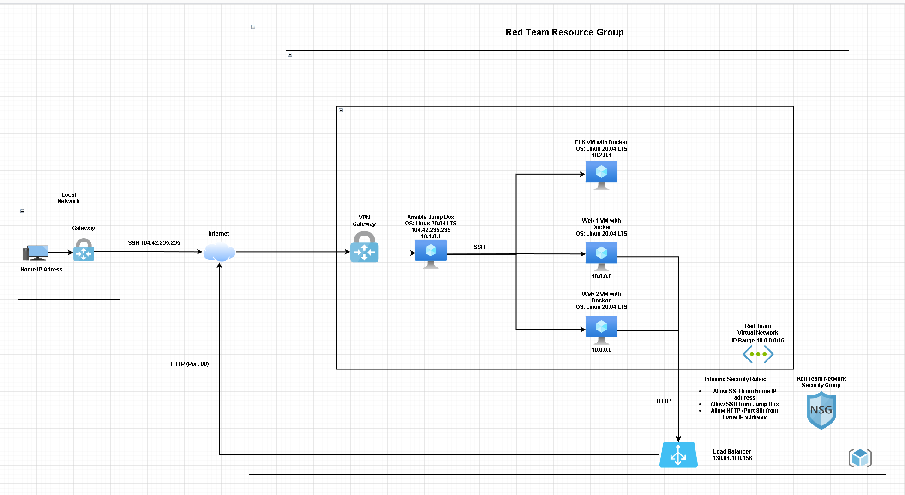

# ELK-Stack-Project
Cybersecurity bootcamp ELK Stack Project for week 13
## Automated ELK Stack Deployment

The files in this repository were used to configure the network depicted below.



These files have been tested and used to generate a live ELK deployment on Azure. They can be used to either recreate the entire deployment pictured above. Alternatively, select portions of the .yml files may be used to install only certain pieces of it, such as Filebeat.

  - [Ansible](https://github.com/Scottyno21/ELK-Stack-Project/tree/main/Ansible)

This document contains the following details:
- Description of the Topology
- Access Policies
- ELK Configuration
  - Beats in Use
  - Machines Being Monitored
- How to Use the Ansible Build


### Description of the Topology

The main purpose of this network is to expose a load-balanced and monitored instance of DVWA, the D*mn Vulnerable Web Application.

Load balancing ensures that the application will be highly available and reliable, in addition to restricting traffic to the network.
- The aspects load balancer protects availabilty and web traffic. An advantage of a Jump Box is the security it provides by acting as a secure computer for admins.

Integrating an ELK server allows users to easily monitor the vulnerable VMs for changes to the data and system logs.
- Filebeat monitors the log files or locations that you specify, collects log events, and forwards them either to Elasticsearch or Logstash for indexing.
- Metricbeat takes the metrics and statistics that it collects and ships them to the output that you specify, such as Elasticsearch or Logstash.

The configuration details of each machine may be found below.
_Note: Use the [Markdown Table Generator](http://www.tablesgenerator.com/markdown_tables) to add/remove values from the table_.

| Name         | Function   | IP Address | Operating System |
|--------------|------------|------------|------------------|
| Jump Box     | Gateway    | 10.1.0.4   | Linux            |
| Web-1        | Web Server | 10.0.0.5   | Linux            |
| Web-2        | Web Server | 10.0.0.6   | Linux            |
| ELK-Stack-VM | ELK Server | 10.2.0.4   | Linux            |

### Access Policies

The machines on the internal network are not exposed to the public Internet. 

Only the ELK machine can accept connections from the Internet. Access to this machine is only allowed from the following IP addresses:
- Home Workstation IP

Machines within the network can only be accessed by your home workstation and the Jump Box machine.
- Jump Box IP: 10.1.0.4

A summary of the access policies in place can be found in the table below.

| Name         | Publicly Accessible | Allowed IP Addresses |
|--------------|---------------------|----------------------|
| Jump Box     | No                  | Home Public IP       |
| Web-1        | No                  | 10.1.0.4             |
| Web-2        | No                  | 10.1.0.4             |
| ELK-Stack-VM | No                  | 10.1.0.4             |

### Elk Configuration

Ansible was used to automate configuration of the ELK machine. No configuration was performed manually, which is advantageous because services running can be limited, system installation and update can be streamlined, and processes become more replicable
- Automating configuration with Ansible frees up time for admins to use for more important tasks.

The playbook implements the following tasks:
- Installs the following apt packages:
  - docker.io
  - python3-pip
```Docker.io and python3-pip code
    - name: Install docker.io
      apt:
        update_cache: yes
        force_apt_get: yes
        name: docker.io
        state: present

    - name: Install python3-pip
      apt:
        force_apt_get: yes
        name: python3-pip
        state: present
```
- Install the following pip package
```Docker
    - name: Install Docker module
      pip:
        name: docker
        state: present
```
- Increase the virtual memory
```Increase Virtual Memory
    - name: Increase virtual memory
      command: sysctl -w vm.max_map_count=262144

    - name: Use more memory
      sysctl:
        name: vm.max_map_count
        value: 262144
        state: present
        reload: yes
```
- Download the Docker container called sebp/elk:761 with the following port mappings:
  - 5601:5601
  - 9200:9200
  - 5044:5044
```Download and launch docker elk container
    - name: download and launch a docker elk container
      docker_container:
        name: elk
        image: sebp/elk:761
        state: started
        restart_policy: always
        published_ports:
          -  5601:5601
          -  9200:9200
          -  5044:5044
```

The following screenshot displays the result of running `docker ps` after successfully configuring the ELK instance.


### Target Machines & Beats
This ELK server is configured to monitor the following machines:
- Web-1 10.0.0.5
- Web-2 10.0.0.6

We have installed the following Beats on these machines:
- Web-1 and Web-2
- Filebeat and Metricbeat have been installed.

These Beats allow us to collect the following information from each machine:
- Filebeat collects system logs which should allows us to see SSH access logs.
- Metricbeat allows us to collect metrics and system statistics and can allow us to see things such as CPU loads on the Web servers.

### Using the Playbook
In order to use the playbook, you will need to have an Ansible control node already configured. Assuming you have such a control node provisioned: 

SSH into the control node and follow the steps below:
- Copy the _____ file to _____.
- Update the _____ file to include...
- Run the playbook, and navigate to ____ to check that the installation worked as expected.

_TODO: Answer the following questions to fill in the blanks:_
- _Which file is the playbook? Where do you copy it?_
- _Which file do you update to make Ansible run the playbook on a specific machine? How do I specify which machine to install the ELK server on versus which to install Filebeat on?_
- _Which URL do you navigate to in order to check that the ELK server is running?

_As a **Bonus**, provide the specific commands the user will need to run to download the playbook, update the files, etc._
